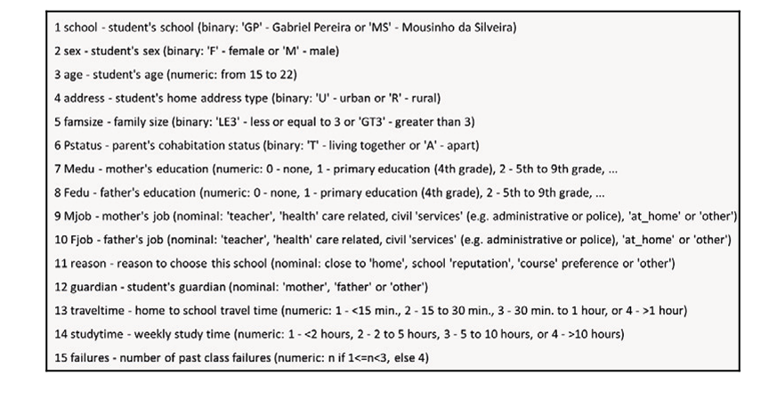
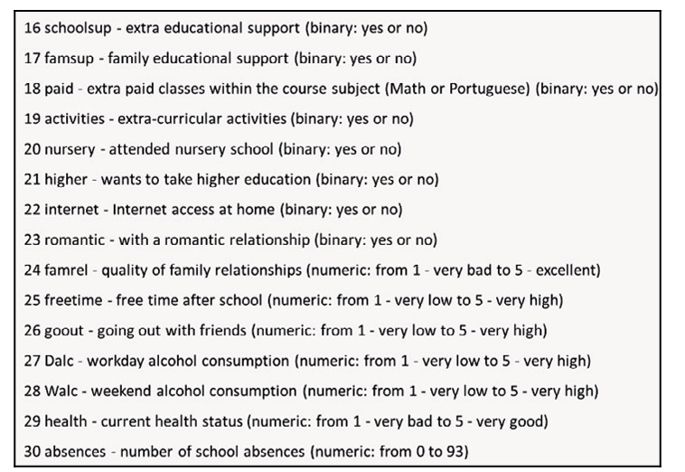

 **Livro Python Artificial Intelligence Projects for Begigners cap#1-  Prediction involving decision trees and**

 Nesta seção, vamos usar árvores de decisão para prever o desempenho dos alunos usando os dados de desempenho passado. Usaremos o conjunto de dados de desempenho do aluno, que é disponível no repositório de aprendizado de máquina UC Irvine em https://archive.ics.uci.edu/ml/datasets/student+performance. Nosso objetivo final é prever se o aluno passou ou falhou. O conjunto de dados contém os dados de cerca de 649 alunos, com e 30 atributos para cada aluno. 
 Os atributos formados são misturados categoricamente palavra e frase, e atributos numéricos. Esses atributos mistos causam um pequeno problema que precisa ser corrigido. Nos será necessário converter esses atributos de palavras e frases em números.

  A captura de tela a seguir mostra a primeira metade dos atributos dos dados
  
**Nota:** Mjob: Ocupação da mãe e FJob: Ocupação da mãe

A seguinte captura de tela mostra a segunda metade dos atributos dos dados:

**Nota:** Fica claro que alguns dos atributos são melhores preditores, como as ausências e o númerode falhas passadas, enquanto outros atributos são provavelmente menos preditivos, como se ou não o aluno está em um relacionamento amoroso ou se o responsável pelo aluno é a mãe, pai, ou outra pessoa. A árvore de decisão tentará identificar o mais importante ou atributos preditivos usando esse ganho de informação fornecido. Poderemos olhar para a árvore resultante e identificar os atributos mais preditivos porque os mais preditivos atributos serão as primeiras perguntas.